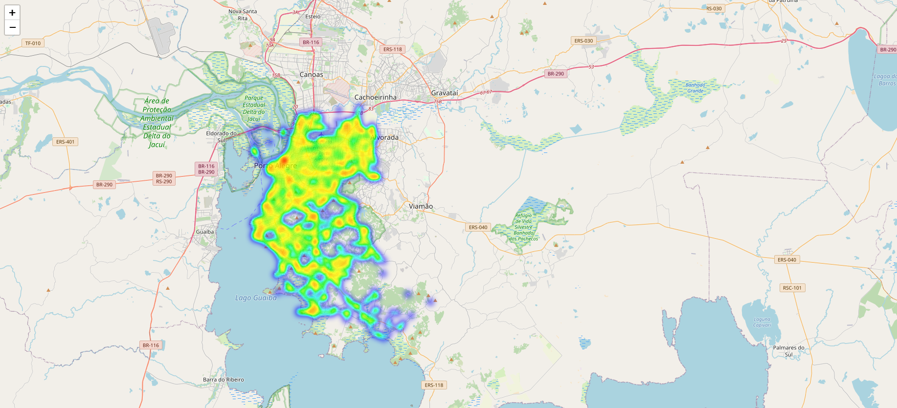
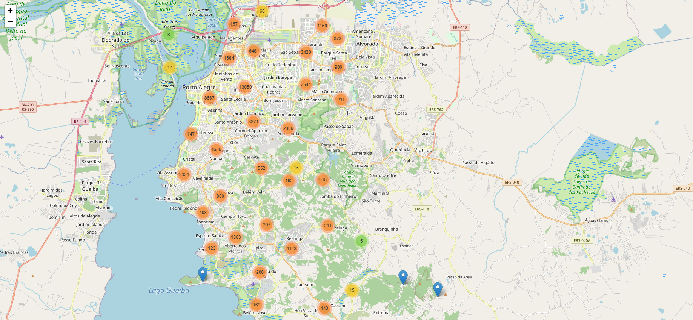

# Análise de Dados de Acidentes de Trânsito

## Visão Geral do Projeto

Este projeto consiste em uma análise exploratória de dados de acidentes de trânsito, com o objetivo de identificar padrões, tendências e insights relevantes que possam auxiliar na compreensão e prevenção de ocorrências. O notebook `ciencia_dados_acidente_transitos.ipynb` detalha todo o processo, desde a importação e limpeza dos dados até a visualização e interpretação dos resultados.

## Fonte de Dados

Os dados utilizados nesta análise são provenientes do arquivo `cat_acidentes.csv`. Este arquivo contém informações detalhadas sobre acidentes de trânsito, incluindo dados como data, hora, tipo de acidente, número de feridos e mortes, localização (latitude e longitude), entre outros.

## Ferramentas e Bibliotecas Utilizadas

O projeto foi desenvolvido em Python, utilizando as seguintes bibliotecas:

-   **pandas**: Para manipulação e análise de dados.
-   **matplotlib.pyplot**: Para criação de gráficos estáticos.
-   **folium**: Para visualização de dados geoespaciais, incluindo mapas interativos.
-   **folium.plugins.HeatMap**: Para criar mapas de calor que mostram a densidade de acidentes.
-   **folium.plugins.MarkerCluster**: Para agrupar marcadores em mapas, facilitando a visualização de grandes volumes de dados de localização.

## Metodologia

A análise seguiu as seguintes etapas:

1.  **Carregamento de Dados**: Importação do arquivo `cat_acidentes.csv` para um DataFrame pandas.
2.  **Limpeza e Pré-processamento de Dados**: 
    -   Remoção de linhas em branco e tratamento de valores ausentes (NaN).
    -   Conversão de tipos de dados (e.g., colunas de data e hora).
    -   Criação de novas variáveis, se necessário, para facilitar a análise.
3.  **Análise Exploratória de Dados (EDA)**:
    -   Cálculo de estatísticas descritivas.
    -   Identificação da distribuição de variáveis categóricas e numéricas.
    -   Análise da frequência de tipos de acidentes, dias da semana, horários e regiões.
4.  **Visualização de Dados**:
    -   Geração de gráficos de barras e histogramas para visualizar a distribuição de acidentes por diferentes categorias.
    -   Criação de mapas interativos utilizando `folium` para visualizar a localização dos acidentes, incluindo mapas de calor para identificar áreas de alta concentração e agrupamento de marcadores.

## Principais Insights (Exemplos, a serem preenchidos com base na análise completa)

-   Identificação dos tipos de acidentes mais frequentes.
-   Períodos do dia e dias da semana com maior incidência de acidentes.
-   Regiões geográficas com maior concentração de acidentes.
-   Correlações entre variáveis que podem indicar fatores de risco.

## Como Executar o Projeto

Para replicar esta análise, siga os passos abaixo:

1.  **Clone o repositório** (se aplicável, ou certifique-se de ter o notebook e o arquivo CSV na mesma pasta).
2.  **Instale as dependências**:
    ```bash
    pip install pandas matplotlib folium
    ```
3.  **Abra o notebook** `ciencia_dados_acidente_transitos.ipynb` em um ambiente Jupyter (Jupyter Notebook ou JupyterLab).
4.  **Execute as células** sequencialmente para reproduzir a análise.

## Contribuições

Contribuições são bem-vindas! Sinta-se à vontade para abrir issues ou pull requests para melhorias, correções ou novas análises.


### folium.plugins.HeatMap: Para criar mapas de calor que mostram a densidade de acidentes.


### folium.plugins.MarkerCluster: Para agrupar marcadores em mapas, facilitando a visualização de grandes volumes de dados de localização.
